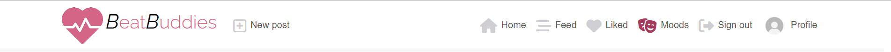

# BeatBuddies


BeatBuddies in an app for sharing music tips with your friends. You can make posts containing a song, image, content and "moods" of your choice. Moods can be whatever the user wants, and are tags for each post that communicates what mood/feeling/genre/general vibe the song has. Posts can be liked and commented so the users can share their feelings, and the users can follow each other to get a custom feed.

The project is a part of the [Code Institute Full Stack Developer Program](https://codeinstitute.net/se/full-stack-software-development-diploma/) and is my fifth and last "portfolio project", with a specialization on advanced front end.

The main goal of the project was to create a front end and a back end part and then successfully connect the two.

The live deployed app: https://beatbuddies.herokuapp.com/

The front end repository: https://github.com/Johneriksson88/BeatBuddies

The live deployed API: https://beatbuddies-api-a72df4dfc93e.herokuapp.com/ (looks best with a browser Json formatter)

The back end repository: https://github.com/Johneriksson88/bb-api

## Table of Contents

# BeatBuddies

## Table of Contents

- [BeatBuddies](#beatbuddies)
- [UX and UI](#ux-and-ui)
  - [Site Owner Goals](#site-owner-goals)
  - [User Stories](#user-stories)
  - [Wireframes](#wireframes)
- [Design](#design)
  - [Imagery](#imagery)
    - [Logo](#logo)
    - [Icons](#icons)
  - [Colours](#colours)
  - [Fonts](#fonts)
  - [Favicon](#favicon)
- [Database Models](#database-models)
- [Features](#features)
  - [Navigation](#navigation)
  - [Home page](#home-page)
  - [Feed page](#feed-page)
  - [Liked page](#liked-page)
  - [Post page](#post-page)
  - [Moods page](#moods-page)
  - [Mood page](#mood-page)
  - [Sign out](#sign-out)
  - [Profile page](#profile-page)
- [Components](#components)
  - [Asset](#asset)
  - [Avatar](#avatar)
  - [MoreDropDown](#moredropdown)
  - [NavBar](#navbar)
  - [NotFound](#notfound)
  - [Comment](#comment)
  - [Post](#post)
  - [Profile](#profile)
  - [PopularProfiles](#popularprofiles)
- [Forms](#forms)
  - [Create post](#create-post)
  - [Sign up](#sign-up)
  - [Sign in](#sign-in)
  - [Create mood](#create-mood)
- [Features Left to Implement](#features-left-to-implement)
- [Technology](#technology)
  - [Programming languages](#programming-languages)
  - [Frameworks](#frameworks)
  - [Libraries](#libraries)
  - [Web services](#web-services)
- [Deployment](#deployment)
  - [Deployment problems](#deployment-problems)
- [Testing](#testing)
  - [HTML and CSS](#html-and-css)
  - [HTML Validator Problems](#html-validator-problems)
  - [JavaScript](#javascript)
  - [Python](#python)
  - [Manual Testing](#manual-testing)
  - [Lighthouse Testing](#lighthouse-testing)
- [Bugs](#bugs)
- [Credits](#credits)
  - [Images & Icons](#images--icons)
  - [Content](#content)
  - [Honorable mentions](#honorable-mentions)
- [My thoughts](#my-thoughts)

#

## UX and UI

### Site Owner Goals

The website was developed to ensure the main goals of the site was met:

- Create posts
- Like and comment each others posts
- Specify the moods of your post
- Get custom content feed from liked or followed users
- Create your own moods
- Basic functionality like sign up/sign in
- Responsive design so it presents well on all devices

#

### User Stories

Agile development practices such as user stories were managed by using GitHub's "Issues" tab in the GitHub repository.

The GitHub project can be found [here](https://github.com/users/Johneriksson88/projects/6).
The Issues page can be found [here](https://github.com/Johneriksson88/BeatBuddies/issues).

1. **Navigation** - As a user I can view a navbar from every page so that I can navigate easily between pages.

2. **Routing** - As a user I can navigate through pages quickly so that I can view content seamlessly without page refresh.

3. **Authentication - Sign up** - As a user I can create a new account so that I can access all the features for signed up users.

4. **Authentication - Sign in** - As a user I can sign in to the app so that I can access functionality for logged in users.

5. **Authentication - Logged in Status** - As a user I can tell if I am logged in or not so that I can log in if I need to.

6. **Authentication - Refreshing access tokens** - As a user I can maintain my logged-in status until I choose to log out so that my user experience is not compromised.

7. **Navigation: Conditional rendering** - As a logged out user I can see sign in and sign up options so that I can sign in/sign up.

8. **Avatar** - As a user I can view user's avatars so that I can easily identify users of the application.

9. **Create posts** - As a logged in user I can create posts so that I can share my images with the world.

10. **View a post** - As a user I can view the details of a single post so that I can learn more about it.

11. **Like a post** - As a logged in user I can like a post so that I can show my support for the posts that interest me.

12. **View most recent posts** - As a user I can view all the most recent posts, ordered by most recently created first so that I am up to date with the newest content.

13. **Search posts** - As a user, I can search for posts with keywords, so that I can find the posts and user profiles I am most interested in.

14. **View liked posts** - As a logged in user I can view the posts I liked so that I can find the posts I enjoy the most.

15. **View posts of followed users** - As a logged in user I can view content filtered by users I follow so that I can keep up to date with what they are posting about.

16. **Infinite scroll** - As a user I can keep scrolling through the posts on the site, that are loaded for me automatically so that I don't have to click on "next page" etc.

17. **Post page** - As a user I can view the posts page so that I can read the comments about the post.

18. **Edit post** - As a post owner I can edit my post title and description so that I can make corrections or update my post after it was created.

19. **Create a comment** - As a logged in user I can add comments to a post so that I can share my thoughts about the post.

20. **Comment date** - As a user I can see how long ago a comment was made so that I know how old a comment is.

21. **View comments** - As a user I can read comments on posts so that I can read what other users think about the posts.

22. **Delete comments** - As an owner of a comment I can delete my comment so that I can control removal of my comment from the application.

23. **Edit a comment** - As an owner of a comment I can edit my comment so that I can fix or update my existing comment.

24. **Profile page** - As a user I can view other users profiles so that I can see their posts and learn more about them.

25. **Most followed profiles** - As a user I can see a list of the most followed profiles so that I can see which profiles are popular.

[26] **User profile** - As a user I can view statistics about a specific user: bio, number of posts, follows and users followed so that I can learn more about them.

27. **Follow/Unfollow a user** - As a logged in user I can follow and unfollow other users so that I can see and remove posts by specific users in my posts feed.

28. **View all posts by a specific user** - As a user I can view all the posts by a specific user so that I can catch up on their latest posts, or decide I want to follow them.

29. **Edit profile** - As a logged in user I can edit my profile so that I can change my profile picture and bio.

30. **Update username and password** - As a logged in user I can update my username and password so that I can change my display name and keep my profile secure.

31. **Create moods** - As a user I can create new moods so that I can connect my posts to my own moods.

32. **Connect moods to a post** - As a user I can assign moods to my posts so that I can connect my posts to feelings.

33. **View moods** - As a user I can view all moods so that I can see what moods are available.

34. **View specific mood** - As a user I can view an individual mood so that I can see what posts are related to that mood.

#

## Wireframes

The wireframes were created using [visily.com](https://app.visily.ai/)

I created wireframes for the pages that differs the most. For example, the different feed pages (home, feed and liked), as well as the sign in and sign up pages, essentially looked the same and hence didn't need separate wireframes.
The goal of the wireframes was to get an idea of the layout of the different pages and party of the content (navlink items etc.).


## Design

#

## Imagery

### Logo

The logo was created through AI at [looka.com](https://looka.com/). As I don't have any design experience, nor the software, I opted to try out one of the many different AI services that can generate logos based on specific input. I found the icon of the heart with soundwaves going through it very representing of the purpose of BeatBuddies: sharing music with friends. Of course the heart representing friendship and the soundwaves the music. The brand text was slightly modified to have bold and italic capital letters to make it a bit more interesting.

### Icons

All the navigation links has corresponding icons to make them more comprehensive, as well as more available for people with reading disabilities.

The like and comment buttons for the posts are solely represented by icons, this being standard nowadays for social media apps.

#

## Colours

The colour scheme of the app is very simple. I didn't want any vibrant backround colors to take away from the posts, which are the main content of the app. So I chose a white backround for the navigation and a slightly off white for the backround of the main container, to have it a bit separated from the navigation.
There are some elements of pink (logo, buttons, active effects and mood tags on posts) to get some colour into the app as a whole, to make it a bit more interesting for the eye. The pink is the brand colour of BeatBuddies so using pink here and there reinforces the brand.

#

## Fonts

The font mainly used in the app is [DM Sans](https://fonts.google.com/specimen/DM+Sans/) from Google Fonts.
It was chosen for it's simple but modern look.

From the [about page](https://fonts.google.com/specimen/DM+Sans/about) of DM Sans:

> DM Sans is a low-contrast geometric sans serif design, intended for use at smaller text sizes.
>
> DM Sans supports a Latin Extended glyph set, enabling typesetting for English and other Western European languages. It was designed by Colophon Foundry (UK), that started from the Latin portion of ITF Poppins, by Jonny Pinhorn.
>
> In May 2023 DM Sans is updated, expanding the coverage of the weight range to Thin & ExtraBlack (100–1000 weight range) along with a new optical size axis.

The brand name in the logo has the font [Raleway](https://fonts.google.com/specimen/Raleway). Raleway is a display font which means it's intended for larger sizes, hence I found it fitting for the brand name which is larger than all other text on the app.

From the [about page](https://fonts.google.com/specimen/Raleway/about) of Raleway:

> Raleway is an elegant sans-serif typeface family. Initially designed by Matt McInerney as a single thin weight, it was expanded into a 9 weight family by Pablo Impallari and Rodrigo Fuenzalida in 2012 and iKerned by Igino Marini. A thorough review and italic was added in 2016.
>
> It is a display face and the download features both old style and lining numerals, standard and discretionary ligatures, a pretty complete set of diacritics, as well as a stylistic alternate inspired by more geometric sans-serif typefaces than its neo-grotesque inspired default character set.
>
> It also has a sister family, Raleway Dots.
>
> More information can be found at theleagueofmoveabletype.com and impallari.com

#

## Favicon

The favicon is the same icon as in the logo, only a smaller size.


#

## Database Models

For the backend part of BeatBuddies I used the [Django REST framework](https://www.django-rest-framework.org/). I first created the models, and then the serializers and views.
The database schema were planned out in [dbdesigner.net](https://www.dbdesigner.net/). DBDesigner is an intuitive browser-based tool to create database schemas.

All models and their respective fields can be seen below:


### User model

The User model takes advantage of the inbuilt User model of Django REST, hence it can not be found in the API directory. It consists of many optional fields, but for this app I am only using the username and password fields.

### Profiles model

The Profiles model contains the information presented on the profile page. It connects to the User model through a one-to-one relationship.

### Posts model

The Posts model contains all the information presented in the Post component, which is used on multiple pages. It connects to the Moods model through a many-to-many relationship (one post can have several moods and one mood can be in several posts) and to the User, Comments and Like models through a one-to-one relationship respectively.

### Moods model

The Moods model contains all the different moods created by the users. The moods are displayed on posts that contains them, as well as on the moods and mood page. It connects to the User model through a one-to-one field and to the Posts model through a many-to-many relationship (explained in the Posts model above).

### Likes model

The Likes model holds the likes created by users. It connects to the Posts and User models through one-to-one relationships respectively.

### Comments model

The Comments model holds all the comments displayed under the individual posts on the post page. It connects to the Posts and User models through one-to-one relationships respectively.

### Followers model

The followers model holds all the links between the users following each other. This was the model that was the hardest for me to get my head around. Basically, the owner field holds the user following another user, and the followed field holds the user that is being followed. Both through one-to-one fields.

## Features

### Logo

The logo is described [here](#logo).

### Navigation

<u>Navigation while not logged in:</u>


<u>Navigation while logged in:</u>



- To the left is the logo with the brand name, and when logged in also the "New post" button. This is for the user to quickly be able to find the button to make a new post.
- To the right are all the other navigation links, along with corresponding icons to make them more visible and quickly understandable, especially for people with reading disabilities.
- The whole navigation bar is conditionally rendered depending on if the user is logged in or not.
- On smaller screens the brand name disappears and only the logo is showed.
- The navigation is based on the bootstrap component NavBar.
- The pages the navigation links point to are explained respectively below.

### Home page

- The home page is the first page that is shown to a user, regardless of being logged in or not.
- It contains of a feed of the Post component, showing posts nested in an infinite scroll component, meaning that if the user scrolls down 10 posts, 10 more posts will load below. This is a fancy alternative to pagination, and prevents the user from having to click to see more posts. It is also good for performance since it does not fetch all the posts at once, only 10 at a time.

- The home page shows all posts sorted by newest first.

### Feed page

- The feed page is just like the Home page, but the selection of posts are filtered by only showing posts from users that the logged in user is following.

### Liked page

- Just as above, but the liked page only shows posts from users that the logged in user has liked.

### Post page

- The post page shows an individual post, while adding the comment field below it.

### Moods page

- The moods page shows all the moods in individual buttons. The moods are clickable to get to the individual mood page.
- To the right is a button for creating a new mood.

### Mood page

- The mood page shows an individual mood, the number of posts it is related to in a header.
- Underneith the header the posts related to the mood are shown.

### Sign out

- The sign out link in the navigation directly signs out the user and redirects them to the home page.

### Profile page

- The profile page has a header containing the users name, profile picture, number of posts, number of followers and the number of users the profile owner is following.
- To the right of the username are a "three dots" icon, that shows a menu for editing profile, changing username and changing password.
- Under the header the posts of the profile owner are shown.

## Components

The BeatBuddies app contains several components. The use of components in React is a very clever way of having to write less code and keep the app more consistent. A component can be reused anywhere it's needed. For example the Post component is the most reused one being used in five pages!
The components also help separate code to get a more comprehensive division of code in the different files.
Although there is a folder called "components" in the src directory, these are not the only components. For example the Post component can be found in pages/posts/Post.js.

### Asset

- The Asset component is a good example of a dynamic reusable component. It takes three different props (spinner, src, message) and for example displays the loading spinner icon if passed the "spinner" prop, or an image if passed the "src" prop.

- It is used almost everywhere where an API call is made and is shown to the user to indicate that the information is being loaded.

### Avatar

- The Avatar component is used everywhere a profile picture is shown, for example along with the usernames in the PopularProfiles component.

- The image size can be passed as a prop, making it usable in all formats.

### MoreDropDown

- The MoreDropDown component is used for the "three dots" icon on the profile page to show the dropdown menu for editing user information". It is also used in the [Comment](#comment) and [Post](#post) components.

### NavBar

- The NavBar component is always shown on the top of the page. More info on it [here](#navigation)

### NotFound

- The NotFound component is shown every time a user tries to visit a page that does not exist.

### Comment

- The comment component is used for every single comment under a post. It shows information about the comment, link to the commenter and a dropdown menu to edit or remove the comment.

### Post

- The Post component is shown on the home, feed, liked, mood and profile pages. It is used to display the posts.
- It uses the bootstrap component Card to nicely organize and display the information.
- On the top part are the posters username, date of the creation of the post and the songs artist and song name, separated by a dash ("-"). The combined artist and song names are displayed in a link that points to the "link" field in the [Posts model](#posts-model).
- In the middle the image for the post is shown.
- Underneith the image are the post title, content, moods and buttons for commenting and liking.
- Clicking on the image takes the user to the individual post page where they can comment.

### Profile

- The Profile component is used in the [PopularProfiles](#popularprofiles) component to show the most popular profiles.

### PopularProfiles

- The Popular profiles component is show in a right column on every page that displays posts and the individual mood page.
- It takes the props "profile", "mobile", and "imageSize" for it to show the most popular profiles conditionally. If the mobile prop is passed only the 4 most popular profiles are displayed.

## Forms

### Create post

- Clicking on the "New post" button in the navigation takes the user to the create post form.
- Here the user can enter all the data for the post.
- Almost all data is validated against the API, and errors are sent back and displayed to the user.
- The one exeption to the above is the validation of the mood select box. This box utilizes the library "react-select" which allowed me to have a nice looking select box with abilities to remove selected moods. An interesting problem about the select box can be found under [bugs](#bugs).

### Sign up

- The sign up form takes a username, password and confirm password.
- It can be reached from the navigation when no user is logged in.

### Sign in

- The sign in form can be reached from the navigation when no user is logged in.
- It takes a username and password.

### Create mood

- The create mood form can be reached from the moods page.
- It only has one input which is the mood name.
- I wanted to give the users freedom to come up with any mood they want, so there is no particular validation of this field except that it can't be empty.

## Features Left to Implement

- Search moods
- Create mood directly in the create post form
- Sucess messages, i.e. "Post successfully created!"
- Popular moods component
- Reposting of others posts
- Autocomplete of adding songs through i.e. the Spotify or YouTube API. This would also automatically fill the "link" field of the post.

#

## Technology

This section covers all technology components and choices.

### Programming languages

- [JavaScript](https://www.javascript.com/)
  - One of the core programming languages of the web.
- [HTML5](https://www.w3schools.com/html/)
  - Standard markup language for Web pages.
- [JSX](https://legacy.reactjs.org/docs/introducing-jsx.html)
  - Reacts clever way of writing JavaScript code combined with HTML.
- [CSS 3](https://www.w3schools.com/css/default.asp)
  - custom styling.
- [Python](https://www.python.org/)
  - an interpreted, high-level, and general-purpose programming language.

### Frameworks

- [React JS 11.2.7](https://react.dev/)
  - Main framework for creating the front end
- [Bootstrap 4.6.0](https://getbootstrap.com/docs/4.6/getting-started/introduction/)
  - to style the content.
- [React Bootstrap 1.6.3](https://www.npmjs.com/package/react-bootstrap)
  - to optimize bootstrap usage with react.
- [Django REST 3.14.0](https://www.django-rest-framework.org/)
  - a powerful Python based framework for creating APIs.

### Libraries

- [Axios 0.21.4](https://axios-http.com/docs/intro)
  - to communicate with the API.
- [React-Select 5.7.3](https://react-select.com/home)
  - mood select box in post create form

### Web services

- [GitHub](https://github.com/)
  - version control and hosting during development.
- [GitPod](https://gitpod.io/)
  - in-browser editor.
- [Code Institute GitPod Full Template](https://github.com/Code-Institute-Org/gitpod-full-template)
  - the template i started my project with.
- [Cloudinary](https://cloudinary.com/)
  - a cloud storage service that i used for image storage.
- [Heroku](https://heroku.com/)
  - for deployment and hosting.
- [Visily](https://www.visily.ai/)
  - to create the wireframes.
- [DB Designer](https://www.dbdesigner.net/)
  - to create the database schema.
- [ElephantSQL](https://www.elephantsql.com/)
  - database hosting.

#

## Deployment

### Deployment to heroku

**In your terminal**

1. Add the list of requirements by running the command "pip3 freeze --local > requirements.txt"
2. Git add and git commit the changes made

**Log into heroku**

3. Log into [Heroku](https://dashboard.heroku.com/apps) or create a new account and log in
4. In the top right-hand corner click "New" and choose the option Create new app, if you are a new user, the "Create new app" button will appear in the middle of the screen
5. Write app name - it has to be unique
6. Choose Region
7. Click "Create App"

**The page of your project opens**

8. **IMPORTANT** - Make sure all secret keys and passwords are kept in an env.py file in your root directory. Put the reference to env.py in the gitignore file as to not accidentally share it with others.
   Access the variables by using e.g.:

```
os.environ.get('SECRET_KEY')
```

9. Click "Settings" from the menu on the top of the page

10. Go to section "Config Vars" and click button "Reveal Config Vars".

11. Add the below variables to the list

    - DATABASE_URL as provided by ElephantSQL
    - SECRET_KEY is the django secret key and can be generated [here](https://miniwebtool.com/django-secret-key-generator/).
    - Cloudinary URL can be obtained from [cloudinary](https://cloudinary.com/). Follow the steps on the website to register.

**Go back to your code**

12. Procfile needs to be created in your app and contain:

```
web: gunicorn PROJECT_NAME.wsgi
```

13. In settings in your base app add the Heroku URL to ALLOWED_HOSTS

14. Add and commit the changes in your code and push to github

**Final step - deployment**

15. Next go to "Deploy" in the menu bar on the top

16. Go to section "deployment method", choose "GitHub"

17. New section will appear "Connect to GitHub" - Search for the repository to connect to

18. Type the name of your repository and click "search"

19. Once Heroku finds your repository - click "connect"

20. Scroll down to the section "Automatic Deploys"

21. Click "Enable automatic deploys" or choose "Deploy branch" and manually deploy

22. Click "Deploy branch"

Once the program runs you should see the message "the app was sussesfully deployed".

### Deployment problems

Initially deploying served some problems. A big one was that my static files didn't load. This is because i didn't have initial serving of the static files.
After double checking my code against [this](https://dev.to/successhycenth/uploading-images-to-cloudinary-storage-from-a-django-drf-application-c40) guide I got it to work.

#

## Testing

### **HTML and CSS**

The HTML and CSS was tested using the tools made available by the [World Wide Web Consortium](https://www.w3.org/), also known as "W3C".

The two tools used were the [Markup Validation Service](https://validator.w3.org/#validate_by_uri) and the [CSS Validation Service](https://jigsaw.w3.org/css-validator/#validate_by_uri).

All HTML-files and the styles.css-file were tested without any errors.

### **HTML Validator Problems**

In using the "Validate by URI" function in the HTML validator, I found that the validator was throwing errors related to the jinja templating language mixed with the HTML (for example for and if statements as ""). The solution i found was to open the page in a browser, righ click anywhere on the page and press "Check page source", and copying the output HTML directly from there and put it in the "Validate by Direct Input" function. This way i get the fully rendered HTML without the jinja template tags and the validation threw no errors.

### **JavaScript**

The script.js-file was tested in the [jshint](https://jshint.com/) tester without any errors or warnings.

### **Python**

All python-files were tested for syntax errors in the [Python syntax checker](https://extendsclass.com/python-tester.html).

I got only one error which was in views.py:

```
Syntax errors detected :

Line 196:
messages.success(request, f"Order #{order_id} successfully deleted.")
^
SyntaxError: invalid syntax
```

Asking friends and fellow students there was no apparent error with the code (note that the debugger does not throw this error) and as it works as intended i left the code as it was.

#

## **Manual Testing**

The site was tested manually across a range of devices to ensure all links and styling work correctly and to ensure responsiveness across a range of devices. All features on the page were tested, especially the form validation, to ensure user feedback worked properly and no faulty inputs could be made.

Testing was carried out on multiple browsers such as Google Chrome, Microsoft Edge, Mozilla Firefox, Safari and Opera. Testing was carried out on an Apple iPhone 12, Apple iPhone 13, Huawei P20, iPad Mini and Windows 10 Desktops.

### **Manual tests**

The manual testing was divided up into the websites different functions:

1. Log in/log out
2. Create account
3. Contact form
4. User panel
5. Order form
6. Customer form
7. Send email

#

1. **Log in/log out**

| Expected outcome                                                                                    | Test                                                               | Result |
| --------------------------------------------------------------------------------------------------- | ------------------------------------------------------------------ | ------ |
| Clicking the Log in button takes me to the login page                                               | Click the login button                                             | PASS   |
| Logging in with an invalid username gives me a feedback message                                     | Enter an invalid username                                          | PASS   |
| Logging in with an invalid password gives me a feedback message                                     | Enter an invalid password                                          | PASS   |
| Clicking any "Rent now" button on the landing page takes me to the log in page if I'm not logged in | Click every "Rent now" button on the landing page while logged out | PASS   |
| Clicking any "Rent now" button on the landing page takes me to the order form if I'm logged in      | Click every "Rent now" button on the landing page while logged in  | PASS   |
| Logging in as a new customer takes me to the customer form                                          | Create an new user and log in                                      | PASS   |
| Logging in as an existing customer takes me to the user panel                                       | Log in as an existing user                                         | PASS   |

2. **Create account**

| Expected outcome                                                                                                    | Test                                                                 | Result |
| ------------------------------------------------------------------------------------------------------------------- | -------------------------------------------------------------------- | ------ |
| Clicking the "Sign up" link on the log in page takes me to the register form                                        | Click "Sign up" on log in page                                       | PASS   |
| Trying to register an account with an existing username gives me a feedback message                                 | Create an account with an existing username                          | PASS   |
| Trying to enter a password that does not match Django standards for a safe password gives me a feedback message     | Create an account with the password "asd"                            | PASS   |
| Trying to enter a different password in the "repeat password" input box gives me a feedback message                 | Create an account with the password "asd" and repeat password "asdf" | PASS   |
| Successfully filling the register form takes me to the login page and gives me feedback that my account was created | Create an account with correct username and password                 | PASS   |

3. **Contact form**

| Expected outcome                                                                                                | Test                                                 | Result |
| --------------------------------------------------------------------------------------------------------------- | ---------------------------------------------------- | ------ |
| Submitting the form without input gives me a feedback message                                                   | Click "Send" without entering anything into the form | PASS   |
| Submitting the form without entering a name gives me a feedback message                                         | Fill all form fields but name field                  | PASS   |
| Submitting the form without entering an email gives me a feedback message                                       | Fill all form fields but email field                 | PASS   |
| Submitting the form entering an invalid email address gives me a feedback message                               | Enter an email without an "@" symbol                 | PASS   |
| Submitting the form without entering a message gives me a feedback message                                      | Fill all form fields but message field               | PASS   |
| Submitting the form with valid input gives me feedback that a message was sent and takes me to the landing page | Enter valid input in the form                        | PASS   |

4. **User panel**

| Expected outcome                                                                                                              | Test                                                     | Result |
| ----------------------------------------------------------------------------------------------------------------------------- | -------------------------------------------------------- | ------ |
| The user panel displays my current orders and contact information                                                             | Go to user panel as a user with current orders           | PASS   |
| If i haven't made any orders yet, I am informed in the "My orders" list                                                       | Go to user panel as a user without any orders            | PASS   |
| Deleting an order takes me to a confirmation page where the relevant order information is displayed                           | Click the trash can icon next to any order               | PASS   |
| Confirming the deletion of an order gives me a feedback message with the relevant order number                                | Delete any order and click confirm                       | PASS   |
| Clicking the "Delete account" takes me to a confirmation page to make sure i have to confirm the deletion                     | Click "Delete account" being logged in as a user         | PASS   |
| Clicking "Delete" on the confirmation page logs the user out, deletes the user from the database and shows a feedback message | Click "Delete" on the account deletion confirmation page | PASS   |

5. **Order form**

| Expected outcome                                                                                         | Test                                                     | Result |
| -------------------------------------------------------------------------------------------------------- | -------------------------------------------------------- | ------ |
| Not selecting a storage unit in the dropdown list gives me a feedback message                            | Submit the order without a selected storage unit         | PASS   |
| Not selecting a start date gives me a feedback message                                                   | Submit the order without a selected start date           | PASS   |
| Selecting a start date that is back in time gives me a feedback message                                  | Submit the order with a start date back in time selected | PASS   |
| Sucessfully filling the order form takes me to a confirmation page where the order details are displayed | Enter correct input in order form                        | PASS   |

6. **Customer form**

| Expected outcome                                                                    | Test                                                                           | Result |
| ----------------------------------------------------------------------------------- | ------------------------------------------------------------------------------ | ------ |
| Submitting any or all fields without imput gives me a feedback message              | Submit the form without input, then one time leaving one field at a time empty | PASS   |
| Submitting the form entering an invalid email address gives me a feedback message   | Enter an email without an "@" symbol                                           | PASS   |
| Submitting the form entering an invalid Swedish zipcode gives me a feedback message | Enter a zipcode with only 4 digits                                             | PASS   |

7. **Send email**

| Expected outcome                                                                                   | Test                                 | Result |
| -------------------------------------------------------------------------------------------------- | ------------------------------------ | ------ |
| Sending an email from the contact form successfully sends an email to the Mailtrap SMTP test email | Fill the concact form and hit "Send" | PASS   |
| When making a new order an email notification is sent to the Mailtrap SMTP test email              | Make a new order in the User panel   | PASS   |
| When deleting an order an email notification is sent to the Mailtrap SMTP test email               | Delete an order in the User panel    | PASS   |

#

## **Lighthouse Testing**


A test was ran using Lighthouse within Google Chrome to verify performance and accessibility standards were met and to ensure best practices were followed.

The following steps were done to improve the score on the Lighthouse test:

- Contrasting text and background colors were altered until complying with AAA-standars, with help from Google Dev Tools for maximum readability.
- Images were compressed by using [TinyPNG](https://tinypng.com/).
- The 'loading = "lazy"' attribute was added to all images, to get them to load when they are scrolled down to, instead of them all loading when the page initially loads.
- Add alt text to all images and aria-labels to all links.

The full report can be viewed [here](main/static/readme/lighthouse_expanded.pdf).

#

## **Wave Testing**


A further test was ran using the Web Accessibility Evaluation Tool (WAVE) to ensure no errors were returned and to verify that no constrast issues existed on the site. This was an important step to ensure that users with disabilities were not negatively impacted by the design of the site and that the relevant standards have been met.

- The contrast warning seemed to be a bug in the validator, since i could not find the element where the warning occurred.
- The Alerts related to the hierarchy of the header elements not appearing in falling order. I decided to ignore these alerts since i was happy with how the headings visually represented their respective elements.

#

## Bugs

### CSRF verification failed

An error that contiuously popped up during development was this:

```
Forbidden (403) CSRF verification failed. Request aborted.
```

Django requires CSRF-tokens (Cross Site Request Forgery) in their forms as a security measure to safely handle requests. Read more on CSRF [here](https://docs.djangoproject.com/en/4.1/ref/csrf/).
In the django settings.py-file you need to explicitly state trusted origins for unsafe requests (e.g POST).
In local development my URL changed day by day (e.g. https://8000-johneriksson88-ekorren-us6khvjs3ar.ws-eu83.gitpod.io/), and when testing my forms and submitting, I was presented with the error above. I soon learned that i had to change the CSRF_TRUSTED_ORIGINS settings variable as my URL changed.

### Database server bugs

The database is hosted by [ElephantSQL](https://customer.elephantsql.com/). Towards the projects end i started getting this error:

```
OperationalError at /login/
connection to server at "mouse.db.elephantsql.com" (13.49.141.18), port 5432 failed: FATAL:  too many connections for role "database_name"
```

After some googling i learned that the free plan on ElephanSQL is to have a maximum of 5 open connections at the same time on their free plan. Looking at the [Django documentation](https://docs.djangoproject.com/en/2.1/ref/databases/#persistent-connections) on persistent connections i learned that i could time out the connections after a set amount of time.
I added the CONN_MAX_AGE setting to the database settings in setting.py like this:

```
DATABASES = {
    'default': {
        'HOST': dj_database_url.parse(os.environ.get('DATABASE_URL')),
        'CONN_MAX_AGE': 0
    }
}

```

Setting CONN_MAX_AGE to 0 terminates the connections immediately, since there is no reason to keep them open after a request. This seems to have fixed the problem.

In the future I am likely to change the database host to a paid service. This is a decision that the site owner will have to take.

### Email SMTP server bugs

When sending an email, either via the contact form on the landing page or making/deleting and order, I sometimes got the following error:

```
Error: SMTP Sender Refused
(530, b'5.7.0 Authentication Required)
```

After googling the error this seemed to be caused on the server side of the [Mailtrap](https://mailtrap.io/) SMTP server i use. I have not found the exact cause of this bug since i can't reproduce it. I found that going into Mailtrap and resetting the credentials for the API made the error go away. I will put a pin in this error since I feel that I have no control over it and that it may come back. Changing to another SMTP service could solve the problem.

In the future, I will change the email settings from the test server to a paid SMTP server plan that can send emails to other recipients than the test server. This is a decision that is on the site owners table, and I am waiting to implement it as soon as i get a go ahead from them.

## Credits

### Images & Icons

[FOTOGRID](https://www.shutterstock.com/sv/g/fotogri)

- The four images on the product cards

#

[r.classen](https://www.shutterstock.com/sv/g/rclassenlayouts)

- Hero image

#

[Fontawesome](https://fontawesome.com/icons)

- All icons apart from the acorn and the four icons in the "Why us" section

#

[Pixel Perfect](https://www.flaticon.com/authors/pixel-perfect)

- Acorn in logo, flaticon and footer

#

[Freepik](https://www.flaticon.com/authors/freepik)

- Calendar icon
- Unloading truck icon
- Open lock icon

#

[Good Ware](https://www.flaticon.com/authors/good-ware)

- Security camera icon

### Content

**Text**

- All text was written by me, John Eriksson, with inspiration and information from the original [Magasinet Ekorren website](https://www.forraduppsala.se/).

#

[Google maps](https://www.google.com/maps)

- Embedded map

**Log in page and register page**

- The design was derived from Youtuber [Dennis Ivy](https://www.youtube.com/c/DennisIvy?app=desktop)s tutorial on [Django user registration](https://www.youtube.com/watch?v=tUqUdu0Sjyc&t=694s&ab_channel=DennisIvy).

**Cookie alert**

- The cookie alert was derived from GitHub user [Wruczek](https://github.com/Wruczek/)s [Bootstrap Cookie Alert](https://github.com/Wruczek/Bootstrap-Cookie-Alert/).

#

### Honorable mentions

- [Dennis Ivys](https://www.youtube.com/c/DennisIvy?app=desktop) Youtube series on Django helped immensely with different aspects of Django.
- [Code Institutes](https://codeinstitute.net/se/full-stack-software-development-diploma/) courses were crucial in introducing me to all involved programming concepts used in this project. Their Tutor Support team also helped me countless times when I felt i had nowhere to go.
- [Code With Steins](https://www.youtube.com/@CodeWithStein) Youtube channel helped me further my Django abilities, especially with the send_mail functions.
- [Stack Overflow](https://stackoverflow.com/) is a forum for all things programming and I cant count how many threads I've browsed as soon as an error, bug or other question has come up.
- [Django forum](https://forum.djangoproject.com/) is another great source for chasing down bugs or errors while exploring Django.
- [The original Magasinet Ekorren website](https://www.forraduppsala.se/) was the source for most of the content, information about storage units, prices etc. The website is in Swedish.
- My lovely wife Helena, for giving me pep talks and taking care of our two young boys while I was hammering away on the computer.

## My thoughts

As this was my first time working with Django, the whole project was a learning process. There are some parts that I could improve on, and I'm sure I will in the future as I finish the course. The nature of having a deadline between home and work life put time constraints on the project that i simply couldn't control. I am happy with the result and it works as intended.

Working with Django is for me a double edged sword. I love the "batteries included" part of Django, which keeps me from having to "invent the wheel" over and over again. For example the User model together with the auth library for log in, registration etc. was a breeze to work with.
On the other hand, I feel that there's so much happening under the hood that I have no idea how they work. It's almost like magic. For example, the database felt like some kind of mystical being just existing and working in the background. It wasn't until i had some problems with it I had to dive in under the hood to see what was happening.

To summarize, Django is a very handy tool for quickly creating fully working applications, but many of aspects of it are kind of out of the developers control. That said, I can't imagine doing the same project without a framework like Django.
